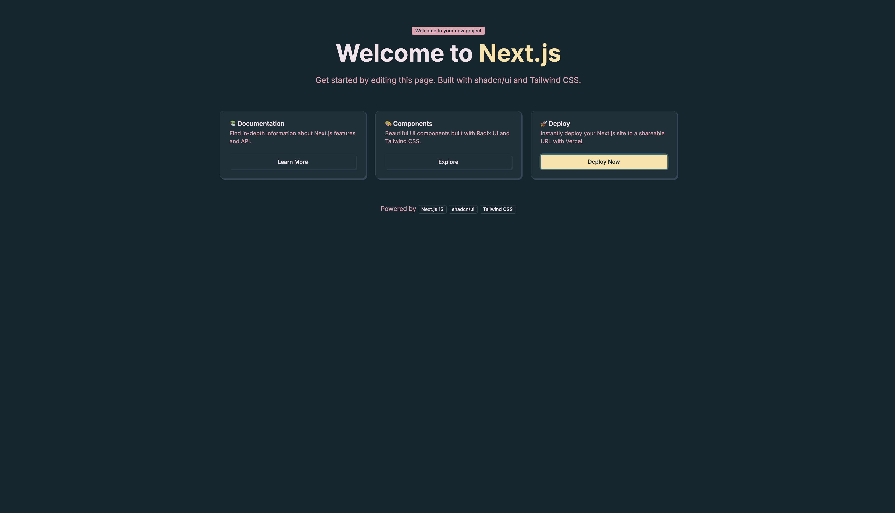

# 🚀 Full-Stack TypeScript Monorepo Template

<div align="center">
  
  
  <br /><br />
  
  
  
  
  
  
  
</div>

<br />

> A production-ready monorepo template featuring Next.js 15, NestJS, Prisma ORM, shadcn/ui, and TurboRepo. Built with TypeScript, optimized for performance, and designed for scalability.

## ✨ Features

- **🏗️ Monorepo Architecture** - Powered by TurboRepo for optimal build performance
- **⚡ Full-Stack TypeScript** - End-to-end type safety across the entire stack
- **🎨 Modern Frontend** - Next.js 15 with App Router, React 19, Tailwind CSS 4, and shadcn/ui
- **🔧 Robust Backend** - NestJS with modular architecture and dependency injection
- **🗄️ Database Ready** - Prisma ORM with PostgreSQL, migrations, and type-safe queries
- **🐳 Docker Development** - Pre-configured PostgreSQL and Redis containers
- **📦 Shared Packages** - Reusable configurations for ESLint, TypeScript, and more
- **🚀 Optimized DX** - Hot reload, type checking, and intelligent caching

## 🏁 Quick Start

```bash
# Clone the repository
git clone <your-repo-url>
cd <your-project-name>

# Install dependencies with Bun (recommended) or npm
bun install

# Initialize environment files
bun run initialize

# Start development services (PostgreSQL + Redis)
bun run services:start

# Run development servers
bun run dev
```

Visit:
- 🌐 Frontend: [http://localhost:3000](http://localhost:3000)
- 🔧 Backend: [http://localhost:3000](http://localhost:3000)
- 🗄️ Database Studio: Run `bun run db:studio`

## 📁 Project Structure

```
.
├── apps/
│   ├── web/                    # Next.js 15 frontend application
│   │   ├── app/               # App router pages and API routes
│   │   ├── components/        # React components
│   │   ├── lib/              # Utilities and hooks
│   │   └── styles/           # Global styles and themes
│   │
│   └── server/                # NestJS backend application
│       ├── src/              # Application source code
│       │   ├── app.module.ts # Root module
│       │   └── main.ts       # Application entry point
│       └── test/             # E2E tests
│
├── packages/
│   ├── database/             # Prisma ORM package
│   │   ├── prisma/          # Schema and migrations
│   │   └── src/             # Database client exports
│   │
│   ├── eslint-config/       # Shared ESLint configurations
│   ├── typescript-config/   # Shared TypeScript configurations
│   └── services/            # Docker services configuration
│
├── docker-compose.yml       # Local development services
├── turbo.json              # TurboRepo configuration
└── package.json            # Root package configuration
```

## 🛠️ Available Commands

### Development
```bash
bun run dev              # Start all apps in development mode
bun run dev:apps         # Start only application servers (no services)
bun run build           # Build all packages and applications
bun run start           # Start production servers
```

### Database
```bash
bun run db:generate     # Generate Prisma client
bun run db:migrate      # Apply database migrations
bun run db:migrate:dev  # Create new migration
bun run db:reset        # Reset database
bun run db:studio       # Open Prisma Studio GUI
```

### Services
```bash
bun run services:start   # Start Docker services (PostgreSQL, Redis)
bun run services:stop    # Stop Docker services
bun run services:restart # Restart Docker services
bun run services:logs    # View service logs
bun run services:clean   # Remove service data
```

### Code Quality
```bash
bun run lint            # Lint all packages
bun run format          # Format code with Prettier
bun run check-types     # TypeScript type checking
bun run test            # Run unit tests
bun run test:e2e        # Run end-to-end tests
```

## 🏗️ Architecture Overview

### Frontend (`/apps/web`)
- **Framework**: Next.js 15 with App Router
- **Styling**: Tailwind CSS 4 with custom design system and shadcn/ui components
- **State Management**: Zustand for client state
- **API Communication**: Native fetch with type-safe endpoints
- **Authentication**: Ready for integration (Clerk/NextAuth)

### Backend (`/apps/server`)
- **Framework**: NestJS with modular architecture
- **API Style**: RESTful endpoints (GraphQL ready)
- **Database**: Prisma ORM with PostgreSQL
- **Authentication**: JWT/Session based (configurable)
- **Testing**: Jest for unit tests, Supertest for E2E

### Shared Packages
- **`@app/database`**: Centralized Prisma client and schemas
- **`@app/eslint-config`**: Consistent linting rules
- **`@app/typescript-config`**: Shared TypeScript settings

## 🐳 Docker Services

The project includes pre-configured Docker services:

```yaml
services:
  postgres:
    - Port: 5432
    - Database: app_dev
    - Username: app_user
    - Password: app_password

  redis:
    - Port: 6379
    - Used for caching and sessions
```

## 🔧 Configuration

### Environment Variables
Each app has its own `.env` file:
- `/apps/web/.env` - Frontend configuration
- `/apps/server/.env` - Backend configuration  
- `/packages/database/.env` - Database connection

### TypeScript Configuration
- Strict mode enabled
- Path aliases configured
- Incremental compilation

### TurboRepo Pipeline
- Intelligent caching
- Parallel execution
- Dependency-aware builds

## 📚 Tech Stack

- **Runtime**: [Bun](https://bun.sh/) (Node.js compatible)
- **Monorepo**: [TurboRepo](https://turbo.build/)
- **Frontend**: [Next.js 15](https://nextjs.org/), [React 19](https://react.dev/), [Tailwind CSS 4](https://tailwindcss.com/), [shadcn/ui](https://ui.shadcn.com/)
- **Backend**: [NestJS](https://nestjs.com/), [Prisma](https://www.prisma.io/)
- **Database**: [PostgreSQL](https://www.postgresql.org/), [Redis](https://redis.io/)
- **DevOps**: [Docker](https://www.docker.com/), [Docker Compose](https://docs.docker.com/compose/)
- **Testing**: [Jest](https://jestjs.io/), [React Testing Library](https://testing-library.com/)
- **Code Quality**: [ESLint](https://eslint.org/), [Prettier](https://prettier.io/), [TypeScript](https://www.typescriptlang.org/)

## 🤝 Contributing

1. Fork the repository
2. Create your feature branch (`git checkout -b feature/amazing-feature`)
3. Commit your changes (`git commit -m 'Add amazing feature'`)
4. Push to the branch (`git push origin feature/amazing-feature`)
5. Open a Pull Request

## 📄 License

This project is licensed under the MIT License - see the [LICENSE](LICENSE) file for details.

---

<div align="center">
  <p>Built with ❤️ using modern web technologies</p>
  <p>
    <a href="#-quick-start">Get Started</a> •
    <a href="#-project-structure">Explore</a> •
    <a href="#-contributing">Contribute</a>
  </p>
</div>
