# Xevon AI - Team Communication Intelligence Platform

**Xevon AI** is a comprehensive SaaS platform that aggregates team communication data from multiple sources (Slack, Teams, GitHub, Discord) and generates actionable AI-powered reports. Built with modern enterprise-grade architecture using a **TurboRepo monorepo** structure.

## 🚀 Quick Start

Get up and running in under 5 minutes:

```bash
# 1. Clone and install
git clone <repository-url>
cd xevon-ai
bun install

# 2. Setup environment
cp .env.example .env
cp apps/web/.env.example apps/web/.env
# Edit .env files with your API keys (see Setup Guide)

# 3. Start development
bun dev
```

**That's it!** Your development environment will be running at:
- 🌐 **Web App**: http://localhost:3000
- 🔌 **API Server**: http://localhost:3001  
- 🗄️ **Database**: localhost:5432 (PostgreSQL)
- 📊 **Database Studio**: `bun run db:studio`

## 📚 Documentation

- 📖 **[Setup Guide](./docs/setup.md)** - Complete step-by-step setup
- ⚡ **[Development Guide](./docs/development.md)** - Comprehensive development workflow  
- 🔐 **[Authentication](./docs/authentication.md)** - Clerk + Prisma integration
- 🌐 **[API Reference](./docs/api.md)** - Available endpoints and usage

## 🏗️ System Architecture

### Overview

This **TurboRepo monorepo** provides a robust, scalable development experience with clear separation of concerns:


### Data Flow & Communication


### Package Dependencies & Build Process

```mermaid
graph LR
    subgraph "Shared Packages"
        DB[📦 @xevon/database<br/>Prisma Client & Types]
        TS[📦 @xevon/typescript-config<br/>Shared TS Settings]
        ESL[📦 @xevon/eslint-config<br/>Shared Linting Rules]
        SVC[📦 @repo/services<br/>Docker Management]
    end

    subgraph "Applications"
        WEB[🌐 apps/web<br/>Next.js 15 Frontend]
        API[🔌 apps/server<br/>NestJS Backend]
    end

    subgraph "Build Process"
        GEN[🔄 Generate Prisma Client]
        MIGRATE[🗄️ Database Migrations]
        BUILD[🔨 Build Applications]
        TEST[🧪 Run Tests]
        LINT[📋 Code Quality]
    end

    %% Dependencies
    DB --> WEB
    DB --> API
    TS --> WEB
    TS --> API
    TS --> DB
    ESL --> WEB
    ESL --> API
    SVC --> GEN

    %% Build flow
    GEN --> MIGRATE
    MIGRATE --> BUILD
    BUILD --> TEST
    BUILD --> LINT

    %% Package to build connections
    DB -.-> GEN
    WEB -.-> BUILD
    API -.-> BUILD

    %% Styling
    classDef package fill:#e3f2fd
    classDef app fill:#e8f5e8
    classDef build fill:#fff3e0

    class DB,TS,ESL,SVC package
    class WEB,API app
    class GEN,MIGRATE,BUILD,TEST,LINT build
```



### Environment Strategy

```mermaid
graph TD
    subgraph "Environment Hierarchy"
        ROOT[🌍 Root .env<br/>Shared Variables]
        
        subgraph "Package Environments"
            WEB_ENV[🌐 apps/web/.env<br/>NEXT_PUBLIC_*, LOG_LEVEL]
            SERVER_ENV[🔌 apps/server/.env<br/>PORT, Server Config]
            DB_ENV[🗄️ packages/database/.env<br/>DATABASE_URL, Prisma]
        end
        
        subgraph "External Services"
            CLERK_VARS[🔐 Clerk Variables<br/>Auth Keys & Webhooks]
            NGROK_VARS[🌐 Ngrok Variables<br/>Auth Token & Domain]
            DB_VARS[🗄️ Database Variables<br/>Connection Strings]
        end
    end

    %% Inheritance
    ROOT --> WEB_ENV
    ROOT --> SERVER_ENV
    ROOT --> DB_ENV

    %% External service mapping
    CLERK_VARS -.-> ROOT
    NGROK_VARS -.-> ROOT
    DB_VARS -.-> ROOT
    DB_VARS -.-> DB_ENV

    %% Styling
    classDef root fill:#e1f5fe
    classDef env fill:#f3e5f5
    classDef external fill:#fff3e0

    class ROOT root
    class WEB_ENV,SERVER_ENV,DB_ENV env
    class CLERK_VARS,NGROK_VARS,DB_VARS external
```



### Monorepo Structure

```
xevon-ai/                           # TurboRepo monorepo root
├── apps/
│   ├── web/                        # Next.js 15 frontend application
│   │   ├── .env                    # Web-specific environment variables
│   │   ├── app/                    # Next.js 15 app router
│   │   ├── components/             # UI components
│   │   └── lib/                    # Utilities and services
│   └── server/                     # NestJS backend API server
│       ├── .env                    # Server-specific environment variables
│       ├── src/                    # Server source code
│       │   ├── users/              # Users module (controllers, services)
│       │   ├── app.module.ts       # Root application module
│       │   └── main.ts             # Application entry point
│       └── test/                   # Server tests
├── packages/
│   ├── database/                   # Shared Prisma database package
│   │   ├── .env                    # Database-specific environment variables
│   │   ├── prisma/                 # Schema and migrations
│   │   └── src/                    # Database client and utilities
│   ├── services/                   # Docker services management
│   ├── typescript-config/          # Shared TypeScript configurations
│   └── eslint-config/              # Shared ESLint configurations
├── scripts/
│   └── wait-for-db.sh              # Database readiness check script
├── docker-compose.yml              # Docker services configuration
├── turbo.json                      # TurboRepo configuration with proper task sequencing
└── .env                           # Root environment variables (shared across packages)
```

### Core Applications

#### 🌐 **Web App** (`apps/web/`)
- **Framework**: Next.js 15 with App Router and React 19
- **UI**: Tailwind CSS with shadcn/ui components
- **State**: Zustand for client-side state management
- **Authentication**: Clerk for user management
- **Features**: Real-time dashboard, connector management, AI report generation

#### 🔌 **Server App** (`apps/server/`)
- **Framework**: NestJS with TypeScript
- **Database**: PostgreSQL with Prisma ORM
- **Architecture**: Modular design with feature-based modules
- **Features**: RESTful API, webhook handling, real-time data processing

#### 🗄️ **Database Package** (`packages/database/`)
- **ORM**: Prisma with PostgreSQL
- **Models**: Users, Connectors, Messages, Reports
- **Shared**: Centralized database client for all apps

## ⚡ Development Commands

### Primary Development
```bash
bun dev              # Start complete development environment
bun run dev:apps     # Start only applications (if services running)
```

### Services Management
```bash
bun run services:start    # Start Docker services (PostgreSQL, Redis, Ngrok)
bun run services:stop     # Stop Docker services
bun run services:restart  # Restart Docker services
bun run services:status   # Check service status
bun run services:logs     # View service logs
bun run services:clean    # Clean up Docker resources
```

### Database Operations
```bash
bun run db:generate       # Generate Prisma client
bun run db:migrate        # Apply database changes
bun run db:studio         # Open Prisma Studio (database browser)
bun run db:deploy         # Deploy migrations (production)
```

### Code Quality
```bash
bun run lint             # Run ESLint across all packages
bun run check-types      # Run TypeScript type checking
bun run build            # Build all applications and packages
bun run test             # Run test suites
```

## 🔧 Environment Configuration

The monorepo uses a **hierarchical environment variable strategy**:

### Required Environment Files
```bash
.env                    # Root: DATABASE_URL, CLERK_*, NGROK_*, NODE_ENV
apps/web/.env          # Web: NEXT_PUBLIC_*, LOG_LEVEL, feature flags
apps/server/.env       # Server: PORT, LOG_LEVEL, server-specific configs
packages/database/.env # Database: Prisma-specific settings
```

### External Services Setup
- **Clerk**: Authentication service ([Setup Guide](./docs/setup.md#clerk-authentication-setup))
- **Ngrok**: Webhook tunneling ([Setup Guide](./docs/setup.md#ngrok-setup))
- **PostgreSQL**: Database (handled via Docker)

## 🐳 Docker Services

The development environment includes:

- **PostgreSQL** (port 5432) - Primary database
- **Redis** (port 6379) - Caching and session storage  
- **Ngrok** (port 4040) - Webhook tunneling for development

All services start automatically with `bun dev` and include health checks.

## 🔄 Development Workflow

### Daily Development Process

1. **Start Development**:
   ```bash
   bun dev
   ```
   This command:
   - 🐳 Starts Docker services in detached mode
   - ⏳ Waits for database readiness
   - 🔄 Generates Prisma client
   - 🗄️ Applies database migrations
   - 🚀 Starts both applications with hot reload

2. **Making Changes**:
   - Edit code in `apps/web` or `apps/server`
   - Database changes in `packages/database/prisma/schema.prisma`
   - Run `bun run db:migrate` after schema changes

3. **Testing**:
   ```bash
   bun run check-types  # TypeScript validation
   bun run lint         # Code quality
   bun run test         # Test suites
   bun run build        # Production build verification
   ```

### Working with the Database

```typescript
// Import shared database client
import { prisma } from '@xevon/database';

// Use in any application
const users = await prisma.user.findMany();
const connector = await prisma.connector.create({
  data: { name: 'Slack', type: 'slack', userId: 'user_123' }
});
```

## 🛠️ Development Features

### Robust Startup Sequence
- **Task Sequencing**: TurboRepo properly sequences database startup before migrations
- **Health Checks**: `scripts/wait-for-db.sh` ensures PostgreSQL is ready
- **Error Prevention**: Eliminates race conditions in development startup

### Type-Safe Development
- **100% TypeScript**: Strict mode enabled across all packages
- **Shared Types**: Centralized through database package
- **Path Aliases**: Clean imports across applications

### Hot Reload Experience
- **Next.js**: Instant updates for frontend changes
- **NestJS**: Automatic server restart on backend changes
- **Database**: Prisma Studio for real-time database inspection

## 🔍 API Endpoints

The NestJS server provides:

| Method | Endpoint | Description |
|--------|----------|-------------|
| GET | `/` | Health check endpoint |
| GET | `/users` | List all users from database |

More endpoints documented in [API Reference](./docs/api.md).

## 🚨 Troubleshooting

### Quick Fixes

**Database connection errors:**
```bash
bun run services:restart && bun run db:migrate
```

**Type errors after changes:**
```bash
bun run db:generate && bun run check-types
```

**Complete environment reset:**
```bash
bun run services:clean
rm -rf node_modules
bun install
bun dev
```

For detailed troubleshooting, see the [Setup Guide](./docs/setup.md#troubleshooting).

## 📋 Prerequisites

- **Bun** >= 1.2.4 (package manager)
- **Docker Desktop** (for services)
- **Node.js** >= 18 (if not using Bun)
- **Git** (version control)

## 🤝 Contributing

1. **Fork the repository**
2. **Create a feature branch**: `git checkout -b feature/your-feature`
3. **Follow development guidelines** in [Development Guide](./docs/development.md)
4. **Test thoroughly**: `bun run check-types && bun run lint && bun run test`
5. **Submit a pull request**

## 📚 Additional Resources

- **[Prisma Documentation](https://www.prisma.io/docs)** - Database ORM
- **[Next.js 15 Guide](https://nextjs.org/docs)** - Frontend framework
- **[TurboRepo Documentation](https://turbo.build/repo/docs)** - Monorepo tooling
- **[NestJS Documentation](https://docs.nestjs.com)** - Backend framework
- **[Clerk Documentation](https://clerk.com/docs)** - Authentication

---

**Built with ❤️ using TurboRepo, Next.js 15, NestJS, and Prisma**